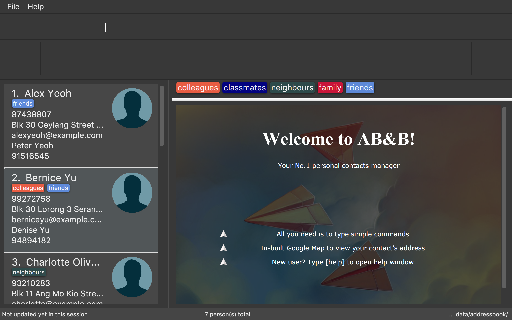

= AB&B (Address Book & Booklets)
ifdef::env-github,env-browser[:relfileprefix: docs/]
ifdef::env-github,env-browser[:outfilesuffix: .adoc]

https://travis-ci.org/CS2103AUG2017-T10-B3/main[image:https://travis-ci.org/CS2103AUG2017-T10-B3/main.svg?branch=master[Build Status]]
https://ci.appveyor.com/project/AceCentury/main[image:https://ci.appveyor.com/api/projects/status/8k9n1ual9t8c7fas?svg=true[Build status]]
https://coveralls.io/github/se-edu/addressbook-level4?branch=master[image:https://coveralls.io/repos/github/se-edu/addressbook-level4/badge.svg?branch=master[Coverage Status]]
https://www.codacy.com/app/damith/addressbook-level4?utm_source=github.com&utm_medium=referral&utm_content=se-edu/addressbook-level4&utm_campaign=Badge_Grade[image:https://api.codacy.com/project/badge/Grade/fc0b7775cf7f4fdeaf08776f3d8e364a[Codacy Badge]]

ifdef::env-github[]

endif::[]

ifndef::env-github[]
image::images/Ui.PNG[width="600"]
endif::[]

* This is a desktop Address Book application for users to manage their personal contacts. It has a GUI but most of the user interactions happen using a CLI (Command Line Interface).
* This application is suitable for users who can type fast.
* With a Next-of-kin field introduced, this application can also be used for administrative purposes e.g by school teachers or employers.
* It is *written in OOP fashion*.
* What's good about this project:
** It has a sophisticated GUI that includes a list panel and an in-built Browser.
** Contains many test cases, including automated GUI testing.
** Supports for _Build Automation_ using Gradle and for _Continuous Integration_ using Travis CI.

== Site Map

* <<UserGuide#, User Guide>>
* <<DeveloperGuide#, Developer Guide>>
* <<AboutUs#, About Us>>
* <<ContactUs#, Contact Us>>

== Acknowledgements

* the original source of the code i.e. AddressBook-Level4 project is created by SE-EDU initiative at https://github.com/se-edu/
* Some parts of this sample application were inspired by the excellent http://code.makery.ch/library/javafx-8-tutorial/[Java FX tutorial] by
_Marco Jakob_.

== Licence : link:LICENSE[MIT]
